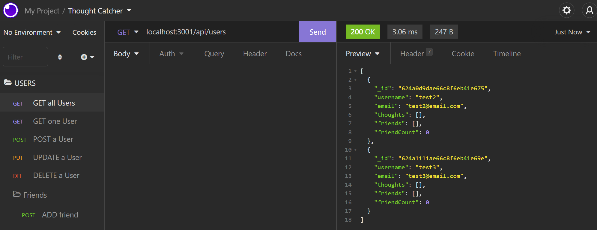

# Thought Catcher

## Description

Thought Catcher is a back-end server that utilizes MongoDB to create a database of a user's thoughts, friends, and reactions!

## Installation

1. Clone the main branch from [GitHub](https://github.com/mimi5930/thought-catcher)
2. Navigate to the root directory

```
~/money-manager
```

3. Install the Thought Catcher's dependencies through node package manager

```
npm install
```

## Usage

- The following video demonstrates the application's functionality
  [](https://drive.google.com/file/d/1JFMqSJAvQu7f_A4vj8lvuuJlMljjwRoe/view)

- If there are issues with video quality try this [alternate link](https://watch.screencastify.com/v/eL3Nw0dDBd36T5mtitc3)

- **To Use Locally** run the application from the root directory

```
npm start
```

- Next, use an application like [insomnia](https://insomnia.rest/download) to make requests to the server's endpoints. The Walkthrough video shows which endpoints to use!

## Credits

This project uses:

- [express](https://www.npmjs.com/package/express)
- [mongoose](https://www.npmjs.com/package/mongoose)
- [date-fns](https://www.npmjs.com/package/date-fns)
